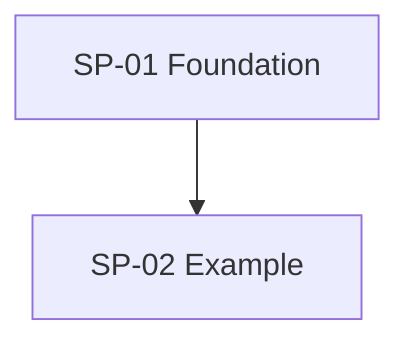
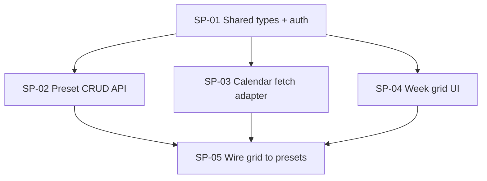

# To Sub-Plans — Templates & Examples

## Sub-plan file (`SP-NN-<short-name>.md`)

```md
# SP-NN: Title

## Type
Foundation | Parallel | Integration

## Blocked by
- SP-XX (reason) — or "None"

## Goal
What this sub-plan delivers, in domain language.

## Owns
Paths this agent may create or modify. **No other sub-plan may touch these.**

## Provides
Contracts others depend on: exports, routes, tables, components, CLI flags.

## Consumes
| From | Contract | Until merged, use |
|------|----------|-------------------|
| SP-XX | `TypeName`, `GET /api/...` | stub in `path` or mock from contracts.md |

## Out of scope
Explicit exclusions to prevent scope creep into sibling sub-plans.

## Implementation notes
Constraints from ADRs, patterns, test commands—not line-by-line steps.

## Done when
- [ ] Acceptance criterion tied to **this** boundary (tests pass with consumes stubbed)
- [ ] Provides documented in `contracts.md` (or PR updates contracts.md)
- [ ] No edits outside **Owns**
- [ ] Sibling agents can merge without renaming your public API

## Agent spawn brief
Paragraph copy-pasteable into a fresh agent: goal, owns, consumes stubs, done when, and pointer to `contracts.md`.
```

## Parent README (`docs/plans/<slug>/README.md`)

```md
# Plan: <title>

## Outcome
One paragraph.

## Global contracts
Link to [contracts.md](./contracts.md). List foundation merge order.

## Dependency graph


## Sub-plans
| Id | Title | Type | Blocked by |
|----|-------|------|------------|
| SP-01 | … | Foundation | — |

## Suggested execution
1. Merge SP-01, then spawn parallel agents for SP-02 and SP-03
2. …
```

## `contracts.md` skeleton

```md
# Contracts: <plan title>

## Version
Bump when breaking; dependents pin this section until they update.

## Types
<!-- shared TypeScript / JSON schema shapes -->

## HTTP / RPC
| Method | Path | Request | Response | Owner sub-plan |

## Events / jobs
| Name | Payload | Publisher | Subscribers |

## File ownership
| Path prefix | Owner SP-NN |
```

## Example graph (non-linear)



SP-02, SP-03, and SP-04 run in parallel after SP-01; each stubs the others via `contracts.md`. SP-05 is a small Integration sub-plan.

## Red flags (re-split)

- Overlapping **Owns** paths
- **Consumes** symbols absent from `contracts.md`
- Tests require sibling *implementation* instead of stub
- Integration sub-plan owns feature logic, not wiring
