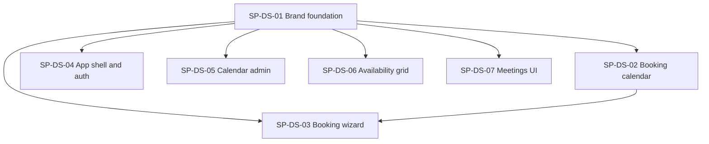

# Plan: Design System Overhaul

## Outcome

Second-phase UI pass (top-design target **8.0+**): white-label **Gushwork** brand tokens, compact viewport-aware layouts, shadcn **Calendar** with slot-count day overlay, per-page admin/public polish, and semantic token migration (breaking removal of `terracotta*` utilities).

Builds on the completed [editorial-ui-overhaul](../editorial-ui-overhaul/README.md) wizard and warm aesthetic — this plan **replaces** terracotta naming with `--primary` semantics and adds brand env configuration.

## Global contracts

Single source of truth: [contracts.md](./contracts.md).

**Merge order:**

1. **SP-DS-01** (foundation — must merge first)
2. **Parallel:** SP-DS-02, SP-DS-04, SP-DS-05, SP-DS-06, SP-DS-07
3. **SP-DS-03** (after SP-DS-02 — integrates `BookingCalendar` into wizard)

## Dependency graph

## Sub-plans

| Id | Title | Type | Blocked by | Owns (summary) |
|----|-------|------|------------|----------------|
| SP-DS-01 | Brand foundation + layout primitives | Foundation | — | `lib/brand/`, `globals.css`, `components/ui/` extensions, `PageContainer`, `AppShell` |
| SP-DS-02 | Booking calendar + slot chips | Parallel | SP-DS-01 | shadcn Calendar, `BookingCalendar`, `SlotPicker`, remove `date-picker-month` |
| SP-DS-03 | Booking wizard + book pages | Parallel | SP-DS-01, SP-DS-02 | `booking-flow`, success panel, admin/public book pages |
| SP-DS-04 | App shell, login, system pages | Parallel | SP-DS-01 | Admin layout, login, 404s, public book layout |
| SP-DS-05 | Calendar admin UI | Parallel | SP-DS-01 | Calendars CRUD, tabs, action bar, member forms |
| SP-DS-06 | Availability grid | Parallel | SP-DS-01 | Grid viewport scroll, legend, toolbar |
| SP-DS-07 | Meetings UI | Parallel | SP-DS-01 | Meeting cards, responsive table, skeletons |

## Provides / consumes (one-liners)

| Id | Provides | Consumes |
|----|----------|----------|
| SP-DS-01 | `BrandConfig`, tokens, `PageContainer`, `AppShell`, `Dialog`, `EmptyState`, `Skeleton`, `DurationChip`, extended `Button`/`Stepper` | — |
| SP-DS-02 | `BookingCalendar`, redesigned `SlotPicker` | UI tokens, `DurationChip` |
| SP-DS-03 | Two-column wizard, `BookingSuccessPanel`, book page shells | `BookingCalendar`, `PageContainer`, `Stepper`, `DurationChip` |
| SP-DS-04 | Branded admin/public shells, login split panel, 404 pages | `AppShell`, `PageContainer`, `EmptyState` |
| SP-DS-05 | Tabbed calendar detail, `CalendarActionBar`, `CalendarStats`, form polish | `PageContainer`, `DurationChip`, `Dialog`, `EmptyState` |
| SP-DS-06 | Viewport-contained availability grid + legend | `PageContainer` |
| SP-DS-07 | Mobile `MeetingCard`, loading skeletons | `PageContainer`, `EmptyState`, `Skeleton`, `Button` |

## Suggested execution

1. Merge **SP-DS-01** — run `npm run test:ds-01` + `npm run build`.
2. Spawn **five agents in parallel:** SP-DS-02, SP-DS-04, SP-DS-05, SP-DS-06, SP-DS-07.
3. Merge **SP-DS-02**, then spawn **SP-DS-03**.
4. Final: `npm test` + `npm run build`; per-page QA checklist in parent plan.

## Source plan

Derived from [design_system_overhaul plan](/Users/ppunit/.cursor/plans/design_system_overhaul_b5ba56c7.plan.md).
