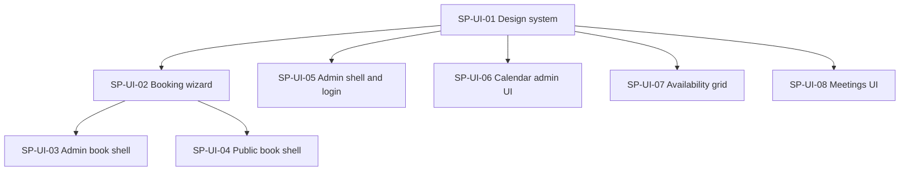

# Plan: Editorial UI Overhaul

## Outcome

Full-app redesign with an **editorial warm** aesthetic (cream paper, Fraunces + Source Sans 3, terracotta accents) and a reworked booking wizard: **Duration → Date → Time → Details**, with month calendar slot-count badges, prominent timezone selector, and horizontal stepper — on both admin and public flows.

## Global contracts

Single source of truth: [contracts.md](./contracts.md).

**Merge order:** SP-UI-01 → then SP-UI-02, SP-UI-05, SP-UI-06, SP-UI-07, SP-UI-08 in parallel → then SP-UI-03 and SP-UI-04 in parallel.

## Dependency graph

## Sub-plans

| Id | Title | Type | Blocked by | Owns (summary) |
|----|-------|------|------------|----------------|
| SP-UI-01 | Design system + middleware | Foundation | — | `globals.css`, fonts, `components/ui/`, `/api/book` public fix |
| SP-UI-02 | Booking wizard core | Parallel | SP-UI-01 | Date→time flow, stepper, timezone, slot grouping |
| SP-UI-03 | Admin book page shell | Parallel | SP-UI-01, SP-UI-02 | `/calendars/[id]/book` page only |
| SP-UI-04 | Public book shell | Parallel | SP-UI-01, SP-UI-02 | `app/book/` layout + page |
| SP-UI-05 | Admin shell + login | Parallel | SP-UI-01 | Admin layout, login, home redirect |
| SP-UI-06 | Calendar admin UI | Parallel | SP-UI-01 | Calendars CRUD pages + `calendar-admin/` |
| SP-UI-07 | Availability grid | Parallel | SP-UI-01 | Availability grid + page |
| SP-UI-08 | Meetings UI | Parallel | SP-UI-01 | Meetings list/table + page |

## Provides / consumes (one-liners)

| Id | Provides | Consumes |
|----|----------|----------|
| SP-UI-01 | Tokens, fonts, UI primitives, public `/api/book` | — |
| SP-UI-02 | `BookingFlow`, `groupSlotsByDate`, date/time pickers | UI primitives |
| SP-UI-03 | Editorial admin book page | `BookingFlow`, `PageHeader`, `Card` |
| SP-UI-04 | Public book layout + page | `BookingFlow`, `PageHeader` |
| SP-UI-05 | Admin nav shell, login page | UI primitives |
| SP-UI-06 | Restyled calendar CRUD | UI primitives |
| SP-UI-07 | Restyled availability view | UI primitives |
| SP-UI-08 | Restyled meetings list | UI primitives, `Button` |

## Suggested execution

1. **Merge SP-UI-01** — verify `npm run test:ui-01` and Storybook-free smoke (render Button in a test).
2. **Spawn five agents in parallel:** SP-UI-02, SP-UI-05, SP-UI-06, SP-UI-07, SP-UI-08.
3. **Merge SP-UI-02**, then **spawn two agents in parallel:** SP-UI-03, SP-UI-04.
4. **Final check:** `npm test` + `npm run build`; manual pass on `/book/{slug}` without auth.

## Agent handoff

Use each sub-plan's **Agent spawn brief**. Read [contracts.md](./contracts.md) before coding. Do not edit files outside **Owns**.
