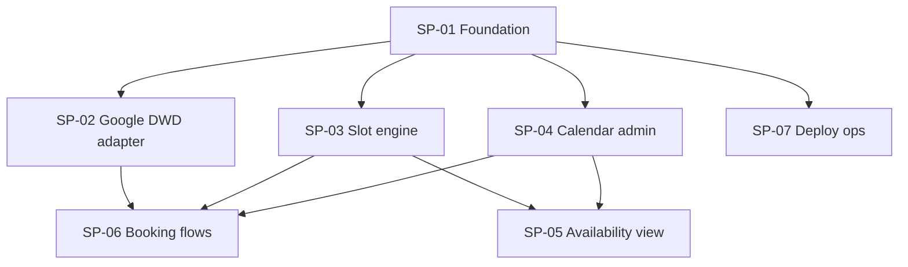

# Plan: Panel Scheduling v1

## Outcome

A recruiter-focused scheduling app where a **Scheduler** creates named **Calendars** (panel pools), views pooled **Member** availability, and books **Meetings** via admin UI or a public candidate link — backed by Google Workspace domain-wide delegation.

## Global contracts

Single source of truth: [contracts.md](./contracts.md).

**Merge order:** SP-01 → then SP-02, SP-03, SP-04, SP-07 in parallel → then SP-05 and SP-06 in parallel.

All routes use `createAppDeps()` from `lib/deps.ts` (SP-01) — stubs until SP-02/SP-03 land; set `USE_STUBS=1` for CI.

## Dependency graph

## Sub-plans

| Id | Title | Type | Blocked by | Owns (summary) |
|----|-------|------|------------|----------------|
| SP-01 | Foundation + contracts | Foundation | — | Scaffold, DB schema, auth, types, ports, stubs |
| SP-02 | Google DWD adapter | Parallel | SP-01 | `lib/google/`, DWD ADR |
| SP-03 | Slot engine | Parallel | SP-01 | `lib/slots/` — slots + load-balanced assignment |
| SP-04 | Calendar admin CRUD | Parallel | SP-01 | Calendar/Member API + admin UI (no booking/availability) |
| SP-05 | Availability view | Parallel | SP-01, SP-03, SP-04 | Day/week grid + `/availability` API |
| SP-06 | Booking flows | Parallel | SP-01, SP-02, SP-03, SP-04 | Booking API, public page, Meetings list/cancel |
| SP-07 | Deploy ops | Parallel | SP-01 | Fly.io, Docker, `.env.example`, README deploy |

## Provides / consumes (one-liners)

| Id | Provides | Consumes |
|----|----------|----------|
| SP-01 | Types, DB, auth, port interfaces, stubs | — |
| SP-02 | `createGoogleCalendarPort()` | Port types from SP-01 |
| SP-03 | `createSlotEnginePort()` | `GoogleCalendarPort` stub → real after SP-02 merge |
| SP-04 | Calendar/Member CRUD routes + admin pages | DB + auth from SP-01 |
| SP-05 | Availability grid UI + busy API | Slot engine + Calendar bundle from SP-03/SP-04 |
| SP-06 | All booking routes + UIs + `lib/booking/` | Google port, slot engine, calendar CRUD |
| SP-07 | Runnable deploy artifact | App scaffold from SP-01 |

## Suggested execution

1. **Merge SP-01** — verify `pnpm test` passes with stubs.
2. **Spawn four agents in parallel:** SP-02, SP-03, SP-04, SP-07.
3. **Merge SP-02 + SP-03 + SP-04** — swap stubs for real ports in CI smoke test.
4. **Spawn two agents in parallel:** SP-05, SP-06.
5. **Final merge** — full E2E against real Google sandbox (optional) + Fly deploy from SP-07.

## Agent handoff

Use each sub-plan's **Agent spawn brief** section. Point agents at [contracts.md](./contracts.md) before coding.

Do not edit files outside **Owns**. Update `contracts.md` only from SP-01 (foundation) unless your sub-plan adds a backward-compatible endpoint — then note in PR and bump contract patch version.
