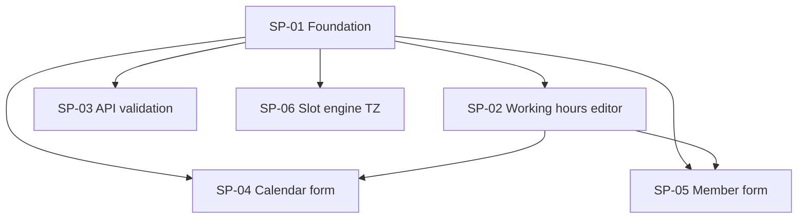

# Plan: Configurable Working Hours + Timezones

## Outcome

Schedulers configure **default working hours** and a **Calendar timezone** on create/edit Calendar forms. Each **Member** may override hours (7-day editor, multiple blocks/day, presets, copy shortcuts) with their own timezone, or use calendar defaults via a toggle. Slot eligibility evaluates hours in each Member's **effective timezone**, not the guest's.

## Global contracts

[contracts.md](./contracts.md) — schema, validation, component props, slot engine semantics.

**Merge order:** SP-01 → then SP-02, SP-03, SP-04, SP-05, SP-06 in parallel.

## Dependency graph

## Sub-plans

| Id | Title | Type | Blocked by | Owns (summary) |
|----|-------|------|------------|----------------|
| SP-01 | Foundation + schema | Foundation | — | Migration, types, `lib/working-hours/*`, `effectiveTimezone` |
| SP-02 | Working hours editor | Parallel | SP-01 | `WorkingHoursEditor`, `TimezoneSelect`, unit tests |
| SP-03 | API validation | Parallel | SP-01 | Calendar/Member API routes |
| SP-04 | Calendar form | Parallel | SP-01, SP-02 | `calendar-form.tsx`, new calendar, settings tab |
| SP-05 | Member form | Parallel | SP-01, SP-02 | `member-form.tsx`, member pages |
| SP-06 | Slot engine timezone | Parallel | SP-01 | `eligibility.ts` + slot tests |

## Provides / consumes (one-liners)

| Id | Provides | Consumes |
|----|----------|----------|
| SP-01 | DB columns, types, `validateWorkingHours`, `effectiveTimezone`, format helpers | — |
| SP-02 | `WorkingHoursEditor`, `TimezoneSelect` | SP-01 types + validate |
| SP-03 | API accepts/validates TZ + hours | SP-01 validate |
| SP-04 | Calendar form saves hours + TZ | SP-02 editor, SP-03 API |
| SP-05 | Member override toggle + save | SP-02 editor, SP-03 API, calendar props |
| SP-06 | Correct slot filtering by member TZ | SP-01 `effectiveTimezone` |

## Suggested execution

1. Merge **SP-01** — run `npm run db:migrate`, verify types compile.
2. Spawn **SP-02, SP-03, SP-04, SP-05, SP-06** in parallel (five agents).
3. Merge SP-02 before or with SP-04/SP-05 (forms import editor).
4. Full `npm test` + manual: create Calendar with custom hours, add Member with override, book slot in guest TZ ≠ member TZ.

## Source plan

Grill decisions and UX research: [.cursor/plans/configurable_working_hours_2d6548d3.plan.md](/Users/ppunit/.cursor/plans/configurable_working_hours_2d6548d3.plan.md).
